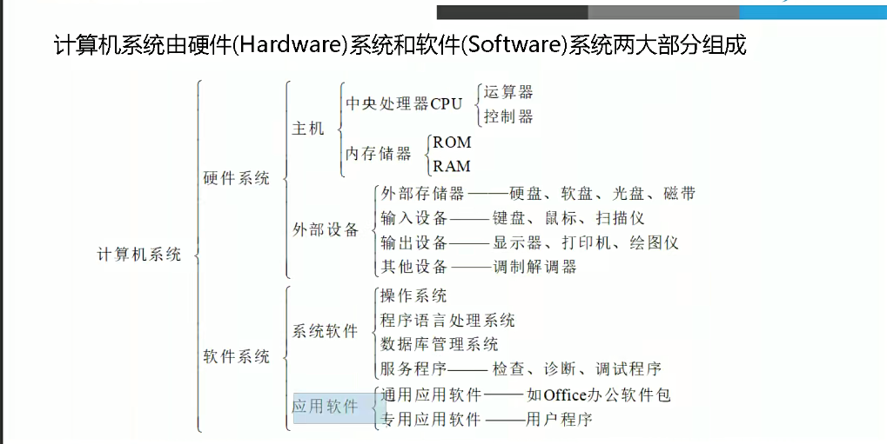
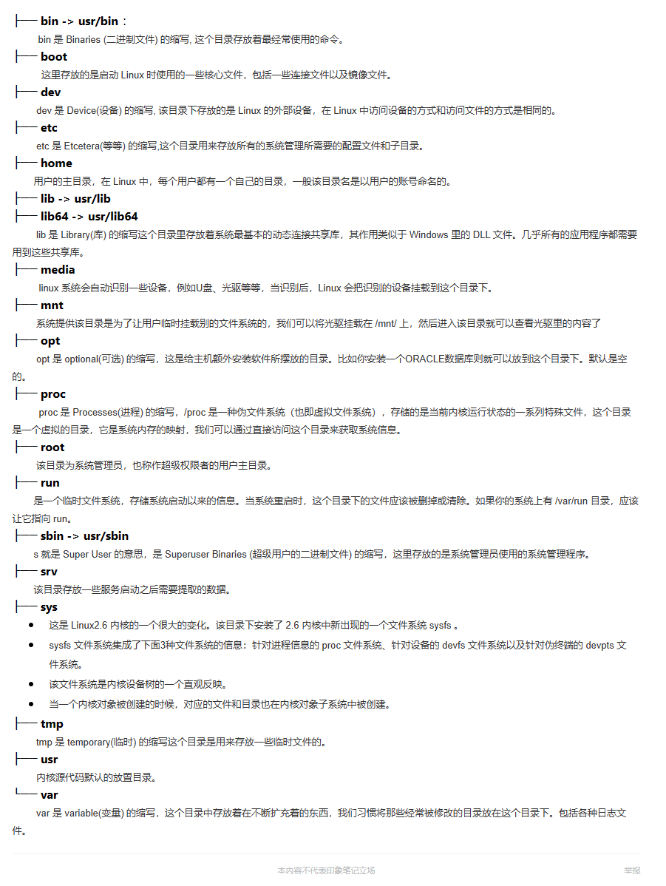

# 1_1. Linux简介

[TOC]

## 1. 我们用linux来干嘛

```
1. 大家都知道linux是一个操作系统，它是一个基础的软件，操作系统是硬件与应用程序的中间层。

2. 在工作中，我们需要在linux上跑各种软件，各种应用，来解决一些生产问题。

```

## 2. 计算机组成


## 3. 操作系统

```
1. 操作系统OS：通用目的的软件程序
硬件驱动
进程管理
内存管理
网络管理
安全管理
文件管理

2. 先学操作系统-->再学操作系统上软件；
3. 操作系统是硬件与应用程序的中间层；
4. 开发接口标准
ABI（Application Binary Interface，ABI）：os与app，ABI包含了应用程序在
这个系统下运行时必须遵守的编程约定。

API（Application Programming Interface）：应用程序编程接口，是一些预先定义的函数，
目的是提供应用程序与开发人员基于某软件或硬件得以访问一组例程的能力，
而又无需访问源码，或理解内部工作机制的细节。

POSIX：可移植操作系统接口（英语：Portable Operating System Interface，缩写为POSIX）。

```

## 4. Linux哲学思想

```
1. 一切皆文件（包括硬件）
2. 小型，单一用途的程序
3. 链接程序，共同完成复杂任务
4. 避免令人困惑的用户界面
5. 配置数据存储在文本中
```

## 5. Linux目录
    

## 6. Linux分区类型
1. GPT：只支持主分区
2. MBR：
    - 主分区：一个硬盘上最多四个；可以安装OS；虽有四个但只有一个是激活状态的主分区；命名1-4
    - 扩展分区：一个硬盘最多一个；不可以直接存数据，要想存数据，需要划分成更小的分区；命名1-4
        - **主+扩展 <= 4**
    - 逻辑分区：在扩展分区内的更小分区单位；命名5...
    - 分区关联（挂载）：将分区挂载到文件夹下
    
3. MBR的分区策略**<mark>(举例子罢了，别当真了，去找真教程)</mark>**
- /dev/sda 200G
    - /dev/sda1 mount /boot 1G mount_point(挂载点)
    - /dev/sda2 mount /          100G
    - /dev/sda3 mount /data   50G
    - /dev/sda4            extend 剩余的硬盘资源
    - /dev/sda5     逻辑分区      swap (特殊的分区，不叫挂载) 
    


