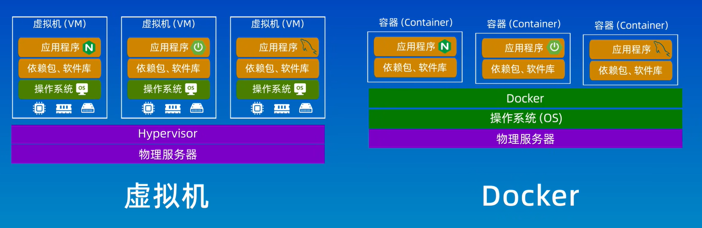
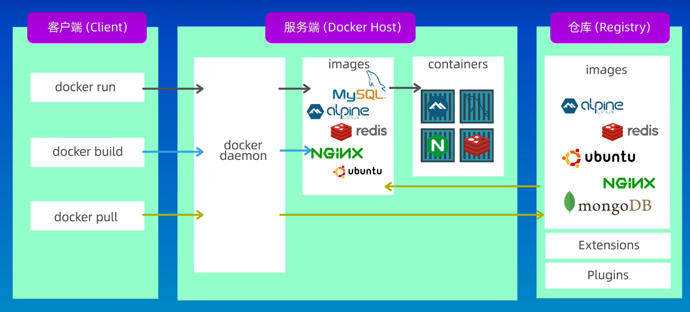

# Docker入门

[TOC]

## 0.前言
>本文根据大佬们的资料整理了<mark>Docker</mark>的基础知识，
>加深对linux运维基础服务工具的理解，以便个人查询复习使用。

## 1.Docker
```
参考：
1.以下方视频内容整理的笔记
[B站GeekHour--Docker入门](https://www.bilibili.com/video/BV14s4y1i7Vf?p=1&vd_source=9f6a57780f9760d9cdd025dbc388f3ba)
2.跟着阿铭学linux--k8s课程
```
>Docker解决一下问题：
>1.应用程序的部署和开发环境的配置过程的纷繁复杂
>2.开发环境好用但是到了测试环境就不好用了
>3.新同事到了项目组要花费大量时间配置开发环境
### 1.1 Docker基本概念
1. **Docker简介**：Docker是一个用于构建（build）、运行（run）、传送（share）应用程序的平台。
2. **Docker和虚拟机的区别**
    1. **<mark>虚拟化技术</mark>**：
        - 是将物理资源虚拟成多个逻辑资源的技术；
        - 可以将物理服务器虚拟成多个虚拟化服务器;
        - 每台虚拟化服务器都有自己的操作系统（os）、CPU、内存、硬盘和网络接口;
        - 他们之间是完全隔离的可以独立运行;
        - 虚拟化在一定程度上实现了资源的整合,可以将一台服务器的计算能机、存储能力、网络资源分配给多个逻辑服务器；
        - 同时虚拟机占用大量的物理资源，导致启动速度慢。
    2. **<mark>Doker</mark>**：
        - Docker是容器的一种实现，是一个容器化的解决方案和平台；
        - 而容器是一种虚拟化技术，和虚拟机类似也是一个独立的环境，可以在这个环境中运行应用程序；
        - 和虚拟机不同的是，docker不需要运行完整的操作系统，而是使用宿主机的操作系统；

3. **Docker的原理和基本概念**

>Docker中的概念：
>>镜像：镜像是只读的模板，它用来创建容器（类似C++中的类）；
>>容器：容器是Docker的运行实例，它提供了一个独立的可移植的环境，可以在这个环境中运行应用程序（类型C++中的类的实例）；
>>仓库：Docker仓库是用来存储Docker镜像的地方，公共仓库：DockerHub；
>>Docker的体系结构：Docker是使用Client-Server架构模式；Docker Daemon就是服务端的守护进程，负责管理Docker的各种资源；
4. **容器化**
    - step-1：创建一个Dockerfile
    - step-2：使用Dockerfile构建镜像
    - step-3：使用镜像创建和运行容器

```
Dockerfile的编写：
1）FROM 指定基于哪个基础镜像
2）MAINTAINER 指定作者信息
3）RUN 后面跟具体的命令
4）CMD 用来指定容器启动时用到的命令，只能有一条，
5）EXPOSE 指定要映射的端口，
6）ENV 为后续的RUN指令提供一个环境变量，我们也可以定义一些自定义的变量，
7）ADD 将本地的一个文件或目录拷贝到容器的某个目录里。 其中src为Dockerfile所在目录的相对路径，它也可以是一个url。
8）COPY 类似于ADD，将本地文件拷贝到容器里，不过它不支持URL，
9）ENTRYPOINT 格式类似CMD 
容器启动时要执行的命令，它和CMD很像，也是只有一条生效，如果写多个只有最后一条有效。和CMD不同是： CMD 是可以被 docker run 指令覆盖的，而ENTRYPOINT不能覆盖。
10）VOLUME 创建一个可以从本地主机或其他容器挂载的挂载点。
11）USER指定RUN、CMD或者ENTRYPOINT运行时使用的用户
12）WORKDIR 为后续的RUN、CMD或者ENTRYPOINT指定工作目录

示例：
FROM ubuntu
MAINTAINER aming aming@aminglinux.com
RUN apt update
RUN apt install -y libpcre2-dev net-tools gcc zlib1g-dev make
ADD http://nginx.org/download/nginx-1.23.2.tar.gz .
RUN tar zxvf nginx-1.23.2.tar.gz
RUN mkdir -p /usr/local/nginx
RUN cd nginx-1.23.2 && ./configure --prefix=/usr/local/nginx && make && make
install
COPY index.html /usr/local/nginx/html/index.html
COPY index2.html /usr/local/nginx/html/2.html
EXPOSE 80
ENTRYPOINT /usr/local/nginx/sbin/nginx -g "daemon off;"
```


### 1.2 Docker的命令整理
>详细的资料可以通过GeekHour的VX公众号获取，
>这里我只作常用的命令整理。

1）启动服务
```
1. systemctl start docker #手动启动
2. systemctl enable docker #开机自启动
```

2）镜像管理
```
1. docker search [image] #检索镜像
2. docker pull [image] #拉取镜像
3. docker image ls / docker images #查看当前系统镜像
4. docker tag [iamge] [tagname] #给镜像打标签
5. docker commit -m "install nginx" -a "aming" web01 nginx_ubuntu:1.0 ##这里的
web01可以改为容器id -- 将容器重新打包成新的镜像
```

3）容器运行
```
1. docker run -itd busybox ##把镜像启动为容器，-i表示让容器的标准输入打开，-t表示分配一
个伪终端，-d表示后台启动，要把-i -t -d 放到镜像名字前面

2. docker run --name [initname] -itd [image] #启动容器时给容器自定义名字

```

4）管理容器
```
1. docker ps -a ##如果不加-a，则不显示已经停止的容器
2. docker stop [image] ##后面这一串字符串为容器ID，可以通过docker ps查看
3. docker rm [image] ##如果容器未停止，会报错，需要加-f选项
4. docker rmi aminglinux:1.2.3 ##这里因为aminglinux:1.2.3为busybox的一个tag，所以此操
作只会删除此tag，并不会真正删镜像，如果该镜像没有tag，则直接删除镜像
5.docker exec -it [container] bash #进入容器操作
```

### 1.3 Docker中的容器
1. **容器是啥**：
简单来说，它就是个小工具，可以把你想跑的程序，库文件啊，配置文件都一起“打包”。
然后，我们在任何一个计算机的节点上，都可以使用这个打好的包。
有了容器，一个命令就能把你
想跑的程序跑起来，做到了一次打包，就可以到处使用。

2. **容器的基本概念**
    - LXC：是Linux Contain的缩写，就是Linux容器，是一个基于Linux内核功能特性实现轻量级虚拟化的技
术。注意，Docker/Podman等容器技术，都是在LXC基础之上开发的三方工具。
    - 容器的隔离：容器有效地将操作系统管理的资源划分到独立的组中，并把各个独立的组进行隔离，可以让各自
的组占用独立的资源，完成自己独立的任务。
    - 容器的共享：容器提供环境隔离的前提下，还提供了资源共享的机制，所以容器比真正kvm 虚拟机的资源要节
省许多;
3. **容器的核心技术**
    - chroot：创建一个虚拟的根目录文件系统，其实质还是调用底层的文件系统，不过是建立一个虚拟的、可
以跟其它容器的虚拟文件系统相互隔离、但共享底层的文件系统
    - namespace：命名空间可以提供一个进程相互隔离的独立网络空间，不同的容器间进程pid可以相同，进程并不
冲突影响，但可以共享底层的计算和存储资源
    - cgroups：实现了对容器的资源分配和限制，比如给容器A分配4颗CPU，8G 内存，那这个容器最多用这么
多的资源。如果内存超过8G ，会启动swap，效率降低，也可能会被调
度系统给kill掉

4. **Docker、k8s与容器的关系**
    - Docker：Docker是容器的一种实现，是一个容器化的解决方案和平台；而容器是一种虚拟化技术，和虚拟机类似也是一个独立的环境，可以在这个环境中运行应用程序；
    - k8s：Kubernetes 就是一个生产级别的容器编排平台和集群管理系统，不仅能够创建、调度容器，还能够监控、管理服务器；