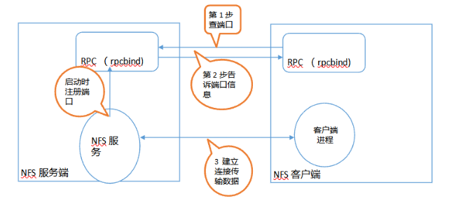

# NFS
[TOC]

## 0.前言
>本文根据大佬们的资料整理了<mark>NFS</mark>的基础知识，
>加深对linux运维基础服务工具的理解，以便个人查询复习使用。

## 1.NFS
>资料来自B站阿铭linux的印象笔记；本人还是初入门，此处笔记以供个人学习使用。
### 1.1NFS简介
1. **简介**
>NFS是Network File System的简写;
>NFS数据传输基于RPC协议，RPC为Remote Procedure Call（远程过程调用）的简写

2. **应用场景**
>A,B，C三台机器上需要保证被访问到的文件是一样的，
>A共享数据出来，B和C分别去挂载A共享的数据目录，
>从而B和C访问到的数据和A上的一致

3. **NFS架构**
1）**端口**
NFS服务端口2049，但是传输数据端口不固定；
PRC端口是111。
2）**PRC存在的意义**
解决NFS服务端和客户端通信多端口并且端口不固定的问题。
3）**RPC主要功能**
指定每个NFS功能所对应的端口，并告诉给客户端，让客户端可以连接到正确的端口上去。
4）**<mark>注意事项</mark>**
**在服务器上，RPC服务必须先与NFS服务启动，否则NFS无法向RFC进行注册。如果RPC重启，它所有管理的注册信息会不见，因此RPC重启后，它所管理的服务都需要重启来重新向RPC注册。**

</br>

4. **工作原理** 


1)服务端开启RPC服务后，开启NFS服务，NFS服务向RPC服务进行注册各项功能对应的端口号、PID、NFS

2)客户端通过本机RPC服务向服务器端RPC服务的111端口发送文件存取请求

3)服务器的RPC服务找到NFS服务注册的端口后，通知客户端的RPC服务

4)客户端获取到正确的端口后，向服务器NFS服务发起连接开始文件读取

>客户端需要安装RPC服务;
>服务端需要安装RPC服务、NFS服务;

### 1.2NFS配置
1. 服务端配置

```
1. 安装NFS
    yum install -y nfs-utils
2. 配置文件/etc/exports
[root@Rocky home]# cat /etc/exports
/home/nfsdir
192.168.119.0/24(rw, sync,all_squash,anonuid=1000,anongid=1000)


rw，rw该目录的读写权限，与文件系统及身份有关

sync，async sync数据会同步写入内存和硬盘，async表示数据暂存内存中，不直接写入硬盘

no_root_squash,root_squash默认情况，使用root会以匿名者使用；

no_root_squash如果是root的登录，会具有root权限

all_squash所有访问用户都映射成匿名用户或用户组

anonuid，anongid指定匿名用户的uiD和pid

3. 创建共享文件 
    mkdir /home/nfsdir
    chmod 777 nfsdir
4. 启动服务
1）检测rpc服务
    systemctl status rpcbind
2）启动nfs服务
    systemctl start nfs-server.service
3）查看服务状态
    systemctl status nfs-server.service
4）加入开机启动
    systemctl enable nfs-server.service
    
```

2. 客户端配置 

```
1. 查看rpc状态
    systemctl status rpcbind
2. 查看远程可挂载资源
    showmount -e "服务端ip"
3. 挂载
    mount -t nfs
4. 永久挂载     
    echo "服务端ip:/home/nfsdir /mntnfsdefaults 0 0">>/etc/fstab
    cat /etc/fstab
```