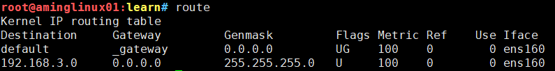

# linux网络基础

[toc]

## 0. 前言
>本文资料内容来自<B站linux超哥>的视频内容整理。

## 1. 通信的概念
通常指的是人与自然人与人之间通过某种介质，或者某种行为进行的信息交互与传递的方式利用电信号传递消息的方式，
利用电信号传递消息的方式，称之为电信，迅速，准确，可靠等特点，不受时间地点，空间距离的限制。
在古代，人类通过驿站，飞鸽传书，烽火台信息，特殊的符号标记，身体语言，眼神，肢体接触等信息传递。
</br>
计算机通信是面向计算机和数据终端之间的一种通信方式，可以实现计算机之间，人和计算机之间的数据生成，存储，数据处理，数据传递在不同的机器之间。
要求处于不同地理位置的计算机，能够互相知道对方的存在，才能互相传递消息，共享资源。

## 2. 计算机网络的概念
学习网络协议，是计算机网络的核心概念。网络协议是什么？
网络协议是计算机网络中进行数据交互而建立的一种规则，也可以说是一套约定、标准的集合。

## 3. 网络层次划分
| OSI七层模型 |      四层概念      |                 层功能                  |           协议            |
| :---------: | :---------------: | :-------------------------------------: | :-----------------------: |
|   物理层    |                   |                                         |                           |
|  数据链路层  |     数据链路层     | 以二进制的数据形式在物理媒介上进行传输数据 |         ISQ@2100          |
|   网络层    |       网络        |             以数据包选择路由             |   IP、ICMP、BGP、OSPF等   |
|   传输层    |       传输        |         提供端对端的接口 IP port         |         TCP、UDP          |
|   会话层    |                   |                                         |                           |
|   表示层    |                   |                                         |                           |
|   应用层    | 最接近用户的应用层 | 提供文件传输、邮件、文件共享、数据加密等等 | HTTP、SNMP、FTP、NFS、DNS |

1. **应用层介绍**：
    -  **任务**：主要是通过进程间的数据交互来完成特定的网络应用
    - 对于不同的网络应用需要使用不同的**网络协议**
        - 域名解析系统：用DNS协议
        - web服务：用万维网HTTP协议
        - 邮件传输：用SMTP协议
    
    - 应用层交互的数据：称之为**报文**

    - 应用层重要的概念之**DNS协议**：域名解析系统DNS（domain name system）是互联的一个**分布式数据库**，主要存储IP和域名的对应关系，能够让普通用户更方便的使用，访问互联网，而不用记住繁琐的ip地址号码
例如：
www.baidu.com   ip地址：123.206.16.61（自己瞎写的以供理解使用）

    - 应用层重要的概念之**HTTP协议**：HTTP （HyperTextTransferPRotocol），超文本传输协议，是互联网上最为应用广泛的一种网络协议，所有的www万维网都得遵循这个标准。设计HTTP协议的初衷是为了方便发布和接收HTML文件（前端的网页文件）的目的。

2. **传输层**
    - **概念**：transport layer --运输层，传输层作用是**向两台主机之间的进程**提供数据传输。
    - **传输层协议**：
        - **传输控制协议（TCP传输）**transmisson control propocol，提供面向连接的，可靠的数据传输服务
        - **用户数据协议（UDP传输）**，user datagram protocol，提供无连接的，尽到他自己最大的努力，进行数据传输，但是不保证数据安全性
    - **TCP和UDP协议的区别**：
        1. udp是无连接的，TCP是面向连接的（好比打电话，通话前，需要先拨号连接上对方，且对方确认接电话了，才能够通信，最后还得对方挂掉电话，才会断开连接）
        2. UDP只尽力传输，不保证数据可靠性。TCP安全性很高，有两个传输的端点，是点对点，一对一的形式
        3. UDP是没有报文的，TCP是有可靠的报文交互，传输的数据，无差错，不重复，不丢失
        4. UDP支持一对一、一对多、多对一、多对多的交互通信（聊天室方面）
        

## 4. ifconfig命令
>作用： 
>1. 用于配置网卡ip地址信息，等网络参数信息或者查看显示网络接口信息，
>2. 类似于windows的ipconfig命令还能够临时性的配置ip地址、子网掩码、广播地址、网关信息等

1. ifconfig命令如果没有需要手动安装：**yum install net-tools**
2. 查看ifconfig手册：**ifconfig --help**

3. **ifconfig使用案例**： 
    1.  **查看网络地址信息**：
        - ifconfig  #查看所有的网络接口信息
        - ifconfig ens33 #查看指定网卡的信息
        -<mark> 网卡配置文件路径是/etc/sysconfig/network-scripts/ifcfg-"自己网卡的名字"</mark>
            - **inet**：ipv4的地址
            - **broadcast**：广播地址
            - **netmask**：子网掩码
            - **ethre**：物理地址
            - **RX / TX packages**：网络收 / 发的流量数据包大小（Receiver、Transmitter）
            
    2. **指定开启、或关闭网卡**
        - ifconfig 设备名字 up/dowm
        - **这条命令不能在服务器上执行**
        
    3.   **修改、设置ip地址**

#添加一个新ip地址
ifconfig ens33:0 192.168.178.111 netmask 255.255.255.0 up
#第二种添加方式
ifconfig ens33:1 192.168.178.120/24 up

   4. **修改机器的MAC地址信息**
ifconfig ens33 hw ether 00:0c:29:13:10:CF
   5. **永久修改网路设备信息**，ifconfig命令只是临时修改网络配置，要永久修改还得写入到配置文件<mark>/etc/sysconfig/network-scripts/ifcfg-"自己网卡的名字"</mark>
    
## 5. route路由命令
1. **什么是route路由？**
计算机之间的数据传输必须经过网络，网络可以直接两台计算机，
也可以通过一个一个的节点去连接路由可以理解为互联网的中转站，
网络中的数据包就是通过一个一个的路由器转发到目的地的。

2. **路由分为静态和动态路由**
    - linux机器上配置的都是静态路由，由运维人员通过route命令管理
    - 动态路由无需人为干预，由路由器、交换机自动分配规则而来。
    
3. **路由案例**
    1. **查看路由表信息**
 
  
        - **参数解析**：
            - **Destination**表示网络号，network的意思
            - **Gateway**：表示网关地址，网络是通过该IP出口，如果显示0.0.0.0的ip，表示该路由信息，是从本机转发出去的
            - **Genmask**：子网掩码地址的表示，IP地址配合子网掩码，才是一个完整的网络信息
            - **Flags**：路由标记，标记当前的网络装太
            - **U**  Up运行的状态
            - **G**  表示这是一个网关路由器
            - **H**  表示这个网关是一个主机
            - **!**  表示当前这个路由已近禁止
            
    2. **添加删除网关信息**
        - **网卡是什么？**：网卡就是数据包不经过任何的设定由路由表最后经过的地址关口
        - **网关**：网络的关口，就好比家里的门一样，外出就得通过这个门，才能出去，数据也是一样，只能通过这个网关地址出外网。
        - **删除默认路由表**：route del default
        - **添加一个网关地址**：route add default gw "ip地址"
      

## 6. ip命令
>ip命令是iproute软件包中强大的网络管理工具。
>ifconfig和route命令的作用，查看系统路由、网络设备，设置策略等功能。

1. ip命令可以操作的对象
    - OBJECT     对象
    - Link          网络设备
    - address    定义ipv4 ipv6的地址        
    - neighbour  查看ARP缓存地址（ARP用于解析MAC地址）
    - route          路由表对象
    - maddress   多播地址
    - tunel          IP上的通道
    
2. ip命令案例学习
    1. 查看，显示网络设备信息：
\# ip addr show "网络设备"
  ip addr show dev ens33
\# 显示网络设备详细的数据包收发大小的情况
  ip -s link show dev ens33


    2. 关闭、激活网络设备：
    \# 关闭网卡
    ip link set ens33 dowm
    
    3. 修改网卡MAC地址信息
    ip link set ens33 address 0:0c:29:13:10:11

    4. 显示网卡信息
    ip a#简写，显示网络设备信息
    ip addr show#第二种写法  
    
    5. ip命令添加，删除ip信息  
ip address add 192.168.178.160/24 dev ens33
#删除ip信息ip address del 192.168.178.161/24 dev ens33

    6. ip命令给网卡添加别名
ip address add 192.168.178.188/24 dev ens33 label ens33:1
#注意添加完毕后，用ifconfig命令能看到别名网卡信息
    7. ip检查arp缓存（显示网络邻居的信息），检查MAC地址信息
    ip neighbo

## 7. netstat命令
>显示网络链接情况，路由表信息，端口状态，网络链接情况等等信息

1. 查看所有网络链接情况
    - netstat -an

2. 常见字段解释
    - proto  套接字使用的协议是什么
    - RecV-Q  连接这个套接字的用户，还未拷贝的字节数
    - Send-Q  远程主机还未确认的字节数
    - Local address  套接字（一个连接情况）本地的地址和端口号
    - Forign Address  套接字的远程主机地址和端口号
    - State  套接字的运行情况，Listen监听中

3. 套接字链接情况参数
    - ESTABLISHED  套接字有一个有效连接。
    - SYN_SENT  套接字尝试建立一个连接。
    - SYN_RECV  从网络上收到一个连接请求。
    - FIN_WAIT1  套接字已关闭，连接正在断开。
    - FIN_WAIT2  连接已关闭，套接字等待远程方中止。
    - TIME_WAIT  在关闭之后，套接字等待处理仍然在网络中的分组
    - CLOSED  套接字未用。
    - CLOSE_WAIT  远程方已关闭，等待套接字关闭。
    - LAST_ACK  远程方中止，套接字已关闭。等待确认。
    - LISTEN  套接字监听进来的连接。如果不设置--listening（-l）或者--all（-a）选项，将不显示出来这些连接。
    - CLOSING  套接字都已关闭，而还未把所有数据发出。
    - UNKNOWN  套接字状态未知。
    
4. netstat使用实际情况
    1. 常用的参数组合
netstat -tunlp #查看机器上正在运行的所有端口情况以及他的进程情况
参数解释如下
-t 显示出TCP的连接情况
-u 显示出UDP的连接情况
-n 不进行dns解析
-1 只显示正在监听中的套接字情况
-p 显示出套接字所属的进程和进程名情况

    
    2. 检测服务器是否运行3306端口（mysql数据库）：netstat -tunlp |grep 3306
    
    3. 显示系统路由情况：netstat -rn 等同于 route -n
    
    4. 显示网络的接口情况：netstat -i 

        - 字段解释
            - Iface  网络设备名字
            - MTU  最大的传输单元，单位为字节
            - RX-OK/TX-OK  正确接收了多少数据包，发送了多少数据包
            - RX-ERR/TX-ERR  接收、发送数据包的时候，丢弃了多少数据包
            - RX-OVR/TX-OVR  由于错误遗失了多少的数据包
            - FLg标记
                - L是回环地址的含义
                - R：这个网络接口正在运行中
                - U：接口正在处于活动的状态
                - B：设置了广播地址
                - M：接收所有的数据包
                - o：表示在该接口上禁止arp
                - P:端对端的连接
        - <mark>查看TX-ERRRX-ERR最好是0，否则表示网络情况不健康，有丢包的现象</mark>
        
    5. 查看服务器监听
        - netstat -tunlplgrep 3306#监听数据库是否运行
        - netstat -tunlplgrep 80#监听web服务是否运行
        - netstat -tunlplgrep 443#监听https服务是否运行
    6. ss
        - 安装：yum install iproute -y
        - ss -an #显示所有的socket套接字连接情况
     
## 8. ping命令
>ping命令，测试当前主机到目的机器的网络连通性


- ping发送给远程主机56字节的数据
- 从目的主机接收到64字节的数据，
- icmp_seq：表示收到的字节数据序列号
- ttl：是数据包的存活时间，秒为单位
- time：是两台机器收发数据的延迟时间

## 9. telnet命令
>用于远程登入主机，因为不安全现在舍弃了；改用ssh远程登录

## 10. ssh命令
```
    ssh 用户名@ip地址
    ssh 用户名@ip地址 -p "自定义的端口号"
```
## 11. wget命令
>wget命令用于下载指定的url资源文件
>>- wget它非常稳定，可以在网速很差的情况下，以及网速很强的情况下都能够很强的适应网络环境，进行下载资源
>>- wget还支持断点续传，当你下载一个大文件，突然失败，下次还可以继续的对该文件下载，直到结束
>>- wget在下载普通文件的时候，即使网络出现问题，它也会不断的尝试再次下载。

```
   -o  指定保存文件的名字
   --limit-rate=1k 限制下载速度
   -c 支持文件断点续传
   -b wget命令后台运行
   --user-agent 设置客户端的身份，伪装成手机端信息
```

## 12. 防火墙

启动： systemctl start firewalld

查看状态： systemctl status firewalld

停止：systemctl stop firewalld

禁用：systemctl disable firewalld