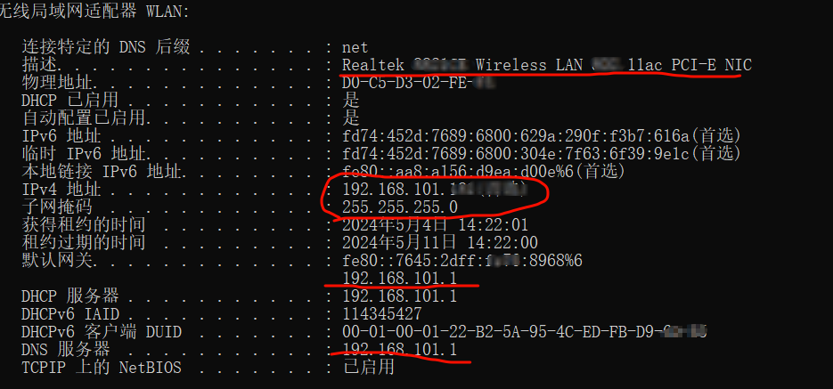
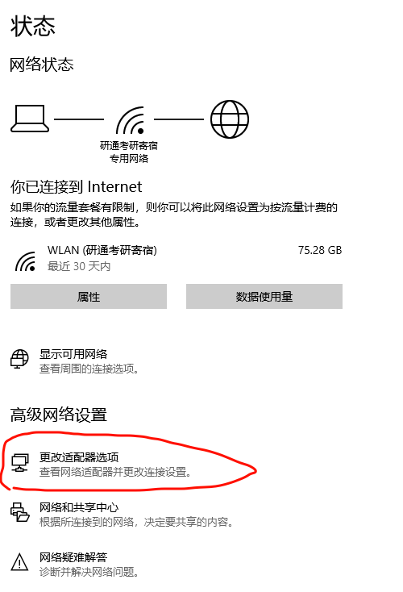
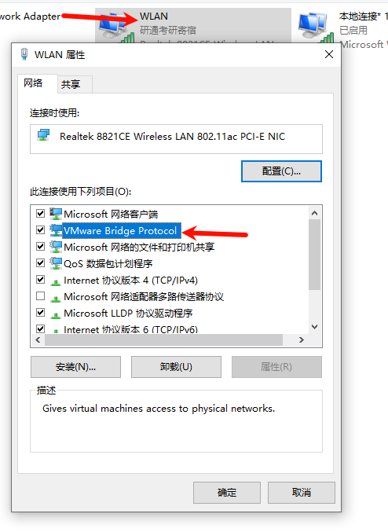
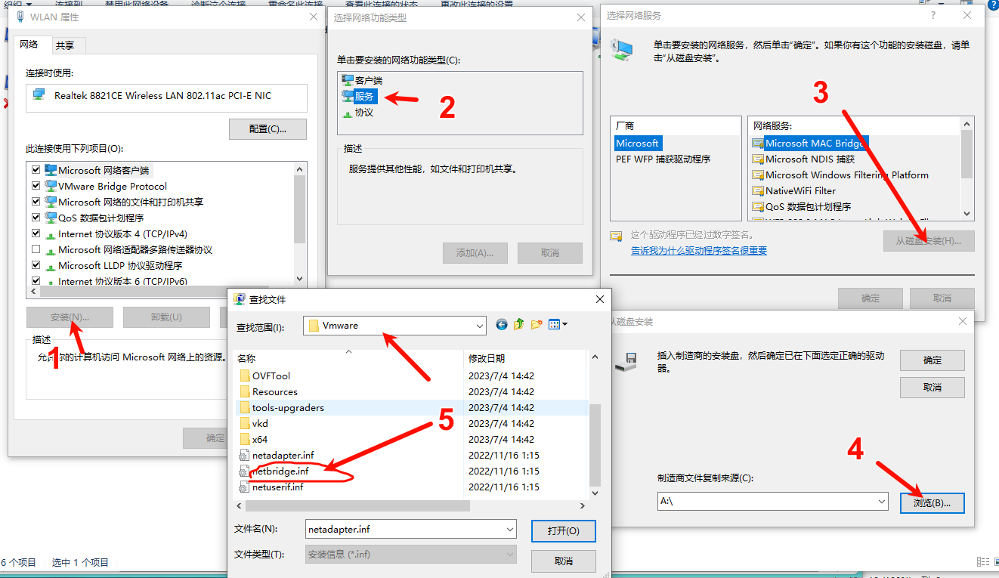
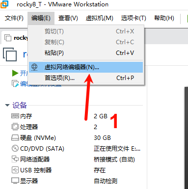
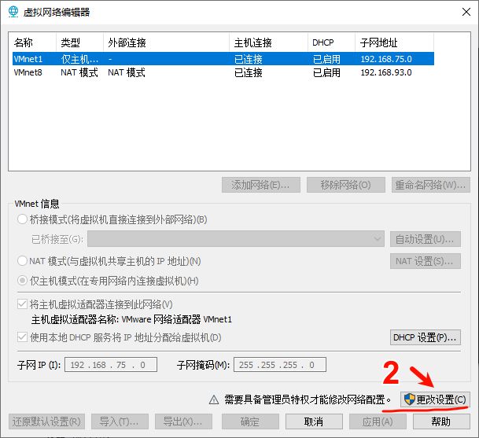
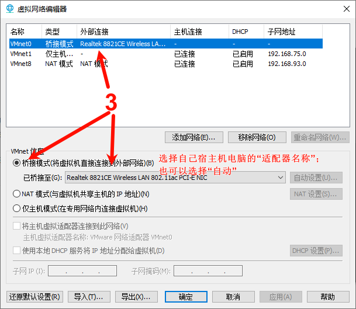
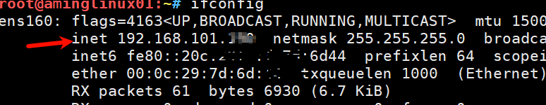

# 虚拟机网络实现桥接模式

*********************************
     虚拟化软件：VMware 17            
     Linux：rocky8_9   
     主机：Win10                          
*********************************
[toc]

## 1. 桥接模式介绍
- 桥接模式使虚拟机直接连接到物理网络，可以与外部设备直接通信，并获取唯一IP地址。

## 2. 查看Win本机的网络信息（以笔记本电脑以WiFi联网为例）
1. 打开cmd，输入ipconfig，查看“**无线局域网适配器 WLAN**”；重点关注**适配器名称、IPV4、子网掩码、默认网关**的信息。


2. 确认网络适配器是否安装VMware Bridge Protocol服务


- 如果没有找到“VMware Bridge Protocol”则执行下面的操作


## 3. VMware虚拟机设置





## 4. 进入linux系统
1. 先输入ifconfig查看一下网络信息

看到虚拟机的ip和win10是在一个网段下的。
2. ping www.baidu.com 看看能不能联网成功。
<br/>
>注意：这里我是没有修改network-scripts的。通过以上三步，进入虚拟机我的是能正常联网的。

3. 修改linux的网卡配置
- 改为静态的ip

```shell
1.  cd    /etc/sysconfig/network-scripts/ifcfg-"网卡的名字"
2.  vi    ifcfg-"网卡的名字"    
```

```vim
TYPE="Ethernet"
PROXY_METHOD="none"
BROWSER_ONLY="no"
BOOTPROTO="static"
IPADDR="192.168.101.120"  //这个是访问我们虚拟机的IP，IP的前三段跟主机一样，最后一段我们自定义，不冲突即可
GATEWAY="192.168.101.1"   //这个网关ip和自己主机的网关ip保持一致
NETMASK="255.255.255.0"   //子网掩码跟自己主机的也保持一致
DNS1="8.8.8.8"            //通过将你的默认DNS改为谷歌的公共DNS服务器
DNS2="8.8.4.4"            //Google公共DNS服务器备用地址
DEFROUTE="yes"
IPV4_FAILURE_FATAL="no"
IPV6INIT="yes"
IPV6_AUTOCONF="yes"
IPV6_DEFROUTE="yes"
IPV6_FAILURE_FATAL="no"
IPV6_ADDR_GEN_MODE="stable-privacy"
NAME="ens33"
UUID="d8fbbece-3798-40d7-9333-351a58f*****"
DEVICE="ens33"
ONBOOT="yes"
```

## 5. 重启网络服务
1. 正常操作 **systemctl restart network**
2. 但是rocky8有所不同，需要**systemctl restart NetworkManager.service**这个命令才可以
- 参考:[rocky](https://forums.rockylinux.org/t/testing-network-service-not-found/2457)
<br/>
>但是我执行了**systemctl restart NetworkManager.service**也不行,"哈哈哈"索性reboot, 重启后ifconfig看到ip地址改成自己修改的了

## 6. 关于DNS

1. DNS是个啥
- DNS的工作原理和电话簿相似，都是管理名称和数字之间的映射关系。
参考:[华为](https://info.support.huawei.com/info-finder/encyclopedia/zh/DNS.html)
2. 8.8.8.8是啥
- 是公共DNS服务器地址,属于Google;
3. 其他的公共DNS服务器地址
- 8.8.4.4（Google公共DNS服务器备用地址）
- 1.1.1.1（Cloudflare公共DNS服务器）
- 9.9.9.9（Quad9公共DNS服务器）
- 208.67.222.222（OpenDNS公共DNS服务器）
- 114.114.114.114（国内通用公共DNS服务器）
- 223.5.5.5和223.6.6.6 (阿里提供的)
参考:[知乎](https://zhuanlan.zhihu.com/p/649915258)