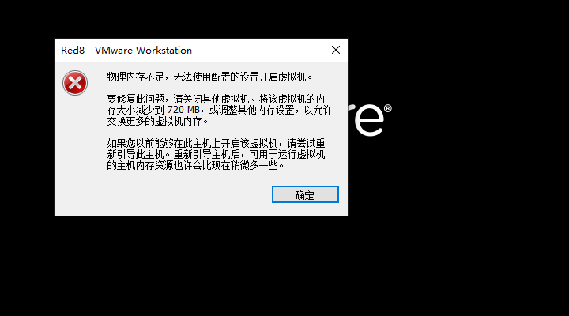
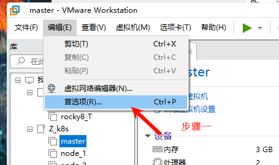
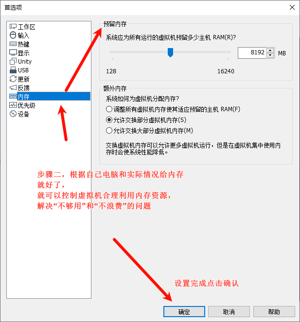

# k8s_杂记

## 11. 搭建单机k8s
```
2G 2G 50G
1. 关闭防火墙
   systemctl disable firewalld
   systemctl stop firewalld
   查看状态
   systemctl status firewalld

2. 关闭selinux
1）安全增强型 Linux（Security-Enhanced Linux）简称 SELinux，它是一个 Linux 内核模块，也是 Linux 的一个安全子系统。
2）getenforce命令来自英文词组“get the current mode of SELinux”的拼写，其功能是用于显示SELinux服务模式。

3）临时关闭：setenforce 0
   永久关闭：vi /etc/selinux/config --> 将 SELINUX=enforcing 改成 SELINUX=disabled
   
3. 关闭swap
1）swapoff -a
2）永久关闭，vi /etc/fstab 注释掉swap那行

4. 设置主机名及配置hosts
   - hostnamectl set-hostname aminglinux01
   - vi /etc/hosts --> 添加ip地址和主机名

5. 将桥接的ipv4流量传递到iptables链
    1）modprobe br_netfilter ##生成bridge相关内核参数
    2）运行命令
cat > /etc/sysctl.d/k8s.conf << EOF
net.bridge.bridge-nf-call-ip6tables = 1
net.bridge.bridge-nf-call-iptables = 1
net.ipv4.ip_forward = 1
EOF
    3）sysctl --system # 生效

6. 时间同步
    yum install -y chrony
    systemctl start chronyd
    systemctl enable chronyd

7. 安装containerd
    1）先安装yum-utils工具
       yum install -y yum-utils
    2）配置Docker官方的yum仓库，
       yum-config-manager \
            --add-repo \
            https://download.docker.com/linux/centos/docker-ce.repo
            
        cat /etc/yum.repos.d/docker-ce.repo --> 可以查看仓库添加到了这个目录下
    3）安装containerd
       yum install containerd.io -y     
    4）启动服务
       systemctl enable containerd
       systemctl start containerd    
    5）生成默认配置
       containerd config default > /etc/containerd/config.toml
    6）修改默认配置
        - vi /etc/containerd/config.toml       
        - sandbox_image = "registry.cn-hangzhou.aliyuncs.com/google_containers/pause:3.8" # 修改为阿里云镜像地址
        - SystemdCgroup = true # 使用systemd cgroup
        - 重启containerd服务
          systemctl restart containerd  
     7）配置kubernetes仓库
        cat <<EOF > /etc/    yum.repos.d/kubernetes.repo
        [kubernetes]
        name=Kubernetes
        baseurl=https://mirrors.aliyun.com/kubernetes/yum/repos/kubernetes-el7-x86_64/
        enabled=1
        gpgcheck=1
        repo_gpgcheck=1
        gpgkey=https://mirrors.aliyun.com/kubernetes/yum/doc/yum-key.gpg https://mirrors.aliyun.com/kubernetes/yum/doc/rpm-package-key.gpg
        EOF
        说明：kubernetes用的是RHEL7的源，和8是通用的

！！！！！注意：教材的pdf文档在复制粘贴过程中，会出现错误导致配置出现问题！！！！！

     8）

```

```
kubeadm init --image-repository=registry.cn-hangzhou.aliyuncs.com/google_containers --apiserver-advertise-address=192.168.93.158 --kubernetes-version=v1.26.5  --service-cidr=10.15.0.0/16  --pod-network-cidr=10.18.0.0/16

Kubernetes 安装成功的信息

Your Kubernetes control-plane has initialized successfully!

To start using your cluster, you need to run the following as a regular user:

  mkdir -p $HOME/.kube
  sudo cp -i /etc/kubernetes/admin.conf $HOME/.kube/config
  sudo chown $(id -u):$(id -g) $HOME/.kube/config

Alternatively, if you are the root user, you can run:

  export KUBECONFIG=/etc/kubernetes/admin.conf

You should now deploy a pod network to the cluster.
Run "kubectl apply -f [podnetwork].yaml" with one of the options listed at:
  https://kubernetes.io/docs/concepts/cluster-administration/addons/

Then you can join any number of worker nodes by running the following on each as root:

kubeadm join 192.168.93.15*:6443 --token u7yyit.eqhbjhczme6vihtg \
	--discovery-token-ca-cert-hash sha256:a0da48829305b5aa45558d9d5f8cd506e3aca42756726dfb8cd93e0a0c1bec79 
```


## 2. 集群
```
1. 查看containerd版本
   rpm -qa |grep containerd 
   
```
```
1. master:
Your Kubernetes control-plane has initialized successfully!

To start using your cluster, you need to run the following as a regular user:

  mkdir -p $HOME/.kube
  sudo cp -i /etc/kubernetes/admin.conf $HOME/.kube/config
  sudo chown $(id -u):$(id -g) $HOME/.kube/config

Alternatively, if you are the root user, you can run:

  export KUBECONFIG=/etc/kubernetes/admin.conf

You should now deploy a pod network to the cluster.
Run "kubectl apply -f [podnetwork].yaml" with one of the options listed at:
  https://kubernetes.io/docs/concepts/cluster-administration/addons/

Then you can join any number of worker nodes by running the following on each as root:

kubeadm join 192.168.93.15*:6443 --token j2h9fv.c0362q9f8doj84il \
	--discovery-token-ca-cert-hash sha256:2f4e72fc895822414290d88dfab8c16739b0b15964e58ef0827812c19a6264d5 
```
## 3. 因为本身电脑配置的原因，要删除一个节点
1. 删除节点

```
**********************************************************************
* 如果需要在k8s集群中删除节点，首先需要在master节点上删除该节点的相关数据，*
* 再删除该节点，接着在该节点上进行reset操作，接着删除相关文件             *
**********************************************************************
1. 在Master节点操作
# 其中< node name >是在k8s集群中使用< kubectl get nodes >查询到的节点名称
kubectl drain <node name> --delete-local-data --force --ignore-daemonsets
kubectl delete node <node name>

2. 在需要删除的节点上
# 重置k8s
sudo kubeadm reset
# 删除残留的文件
sudo rm -rf /etc/kubernetes/
# 清除iptables或者ipvs的配置
sudo iptables -F && iptables -t nat -F && iptables -t mangle -F && iptables -X
sudo ipvsadm --clear

参考：[腾讯云](https://cloud.tencent.com/developer/article/2126222)    
```

## 4. 获取节点信息

```

获取节点信息：
kubectl get node 
kubectl get pod --all-namespaces

kubernetes
kubelet-1.26.2 kubeadm-1.26.2 kubectl-1.26.2
```
## 5. kubernetes、kubelet、kubeadm、kubectl

```
Kubernetes（简称k8s，因为第一个字母k和最后一个字母s中间有8个字母）是谷歌开源的一套容器化集群管理系统，当下已被众多大厂及中小企业采用，容器化技术是目前的大势所趋。

kubeadm：用来初始化集群的指令。

kubelet：在集群中的每个节点上用来启动 Pod 和容器等。

kubectl：用来与集群通信的命令行工具。
```

## 6. 节点也想执行kubectl get nodes 指令

```
在master节点执行
yum install rsync
rsync -av $HOME/.kube/ nodehostname:/root/.kube/
或者
scp -r /root/.kube/ nodehostname:/root/.kube

!!可能出现的错误：
ssh: Could not resolve hostname aminglinux02: Name or service not known
lost connection

解决：配置masert的/etc/hosts 文件，添加node节点的ip和主机名映射
```

## 7. 查看站点信息和由yaml文件创建pod

```
1. 查看站点
kubectl get node 
kubectl get pod --all-namespaces

2. 创建站点
    1）在root家目录下创建一个k8s目录
    2）创建yaml文件
    3）kubectl create namespace "yaml文件中的namespace"
    4) kubectl apply -f testpod.yaml  #应用一下这个yaml
       运行结果 "yaml中的kind"/"yaml文件中metadata的name" cerate
    5）查看一下信息
       kubectl get po -n "yaml文件中的namespace"
       kubectl describe po "yaml文件中metadata的name" -n "yaml文件中的namespace"
       
3. 删掉pod
   - kubectl delete -f ***.yaml
   - 再重新来一边创建
   - 或者 -- 强制杀掉
        kubectl delete --force pod "yaml文件中metadata的name" -n "yaml文件中的        namespace"
   

!!！！！注意可能kubectl delete -f ***.yaml时提示error: the server doesn't have a resource type "***"。我是阴差阳错的先删掉镜像后再执行kubectl delete -f ***.yaml成功了。
    - crictl ps -a --> 查看完整的pod信息，对比IMAGE ID
    - crictl image --> 调出镜像信息，复制IMAGE ID
    - critcl rmi "IMAGE ID"
    - 在***.yaml所在文件路径下执行kubectl delete -f ***.yaml
      --> 成功提示pod "podname" deleted
      
4. 查看在那个节点上调度
   crictl images
   
5. 查看k8s日志
   journalctl -u kubelet


！！！！！在2.5节课中有个错误需要重新apply calico.yaml
    也是要在calico.yaml文件所在目录下才可以
    kubectl delete -f calico.yaml
    kubectl apply -f calico.yaml

```

## 8. pod资源限制
```
1. 在docker中最小单元是容器；而k8s中的最小单元是pod，pod里面存放容器


```

## 9. kubernetes 如何彻底删除pod、deployment、service

```
1. 创建deployment，及删除deployment（deployment是pod的集合可以一次性创建好多个同一个namespace的pod）

1）创建，例子：kubectl create deployment testdp --image=nginx:1.23.2 -n aming --replicas=7 
--> 由镜像nginx:1.23.2；在命名空间aming下复制7个testdp-**-*名字的容器

2）删除，
    - 删除一个deployment：kubectl delete deployment DEPLOYMENT_NAME -n NAMESPACE_NAME （DEPLOYMENT_NAME即testdp）
    - 删除所有deployment：kubectl delete deployment -all
    
3）deployment特性，它是来管理一堆pod的，就是如果管理的pod出现了问题，
    第一种方法：    
        可以使用crictl ps -a 查看所有的container；
        再使用  crictl stop container_name 停掉；
        再使用  crictl rm   container_name 删掉
    第二种方法：
        可以使用 kubectl delete --force pod pod_name -n pod_namespace 删掉一个；
    ** deployment会重新创建一个pod **   
    
2. 删除pod
    - 删除所有pod：kubectl delete pod --all
    - 删除一个：kubectl delete pod POD_NAME -n NAMESPACE_NAME

3. 删除service
    因为pod都删除了，对应的service就没有用了
    - kubectl delete svc SERVICE_NAME -n NAMESPACE_NAME
```

## 10. API资源对象Deployment

1. pod（单个的）之上为Deployment（pod的集合），用Deployment的目的是为了负载均衡和高可用。
2. Deployment可以定义同一时间创建多个pod
3. 查看pod分配到哪个节点上
    - kubectl get po -o wide
    - kubectl get po --all-namespaces -o wide 
    
## 11. API资源对象Service

1. Service的作用为对外访问提供一个入口；
2. deployment（**labels**）必须有一个service绑定在一起（**selector**）对外提供服务；
3.  端口：
    - port--service的port；
    - targetPort--deployment的port     
4. 查看svc详情
    - 查看一个详情：
        - kubectl describe svc ".yaml里的svcname"
    - 查看所有：
        - kubectl get svc  
5. 三种Service类型
    - ClusterIP：该方式为默认类型，即，不定义type字段时（如上面service的示例），就是该类型。
    - NodePort：如果想直接通过k8s节点（k8s宿主机IP）的IP直接访问到service对应的资源，可以使用NodePort，Nodeport对应的端口范围:30000-32767
    - LoadBlancer：这种方式，需要配合公有云资源比如阿里云、亚马逊云来实现，这里需要一个公网IP作为入口，然后来负载均衡所有的Pod。
    
## 12. API资源对象DaemonSet

1. 应用场景：有些场景需要在每一个node上运行Pod（比如，网络插件calico、监控、日志收集），Deployment无法做到，而Daemonset（简称ds）可以。Deamonset的目标是，在集群的每一个节点上运行且只运行一个Pod。

```
1. 主节点有一个保护机制，不允许ds或者普通的pod在master上运行，保护主节点的资源。
2. 解决这个保护机制：
1）查：kubectl describe node k8s01 |grep -i 'taint'
2）改：改.yaml
在spec: 下添加一下内容，与containers对齐
tolerations:
  - key: node-role.kubernetes.io/control-plane
    effect: NoSchedule     
```
2. 创建ds
    - kubectl apply -f dsname.yaml
3. 查看ds
    - kubectl get ds
    - kubectl get po
    - kubectl get po -o wide
    - kubectl get po -o wide -w （**动态查看**）
    - kubectl get po --all-namespaces
    - kubectl describe ds
    
## 13. 关于VMware虚拟机为“系统运行的所有虚拟机预留多少主机RAM（R）”的心得

```
疑问：我的电脑是8G+8G双通道的内存，当我在搭建k8s集群时给master-2G内存，node1-3G内存，node2-3G内存；
当依次打开虚拟机到node2时VM提示“物理内存不足，无法使用配置设置的虚拟机”。
这里我就很纳闷了，为什么2+3+3也才8G，为什么会不能打开node2呢。
打开win10的资源管理器查看内存使用情况，“VM”+“win10上应用的内存”才10G还有6G的空余内存。这是为什么呢？

解决：这个问题导致我的实验不能正常运行，我一直以为是双通道内存分配的问题。
偶然间在VM虚拟机的菜单栏里“编辑-->首选项-->内存”设置里看到“预留内存”只给了4G，
这时恍然大悟，在这里设置“预留内存”给到8G，
然后去实验三个节点是不是能正常打开，
结果是不在报错，三个节点都能打开。完美解决。
```

